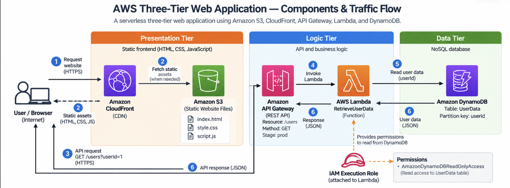

# AWS Three-Tier Web Application

A highly available three-tier web application deployed on AWS using
separate presentation, application, and database layers.

## Architecture



### Architecture Overview

The application follows a three-tier architecture:

- Presentation Tier
- Application Tier
- Database Tier

Traffic flows through the public-facing entry point into the application
tier, while the database remains isolated from direct internet access.

## AWS Services

| Service | Purpose |
|---|---|
| Amazon VPC | Network isolation |
| Application Load Balancer | Distributes application traffic |
| Amazon EC2 | Hosts application workloads |
| Amazon RDS | Database layer |
| IAM | Access control |
| Security Groups | Network-level access control |
| CloudWatch | Monitoring and logging |

## Architecture Flow

```text
User
  |
  v
Application Load Balancer
  |
  v
Application Tier
(EC2)
  |
  v
Database Tier
(RDS)
